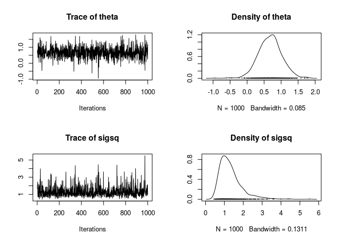

Sampling from the Normal model using Gibbs
------------------------------------------

Here is a set of data

    y = c(0.57, 0.71, -0.45, 0.92, -0.67, 3.04, 0.32, 1.38, 1.76, -0.14, -0.37, 0.69)

In class, we saw the model
$$ \\boldsymbol{y} \\overset{\\mathrm{iid}}{\\sim} N(\\theta, \\sigma^2) $$
 with conjugate priors
*θ* ∼ *N*(*μ*0, *τ*02)
 and
*σ*2 ∼ *I**n**v*-*χ*2(*σ*02, *ν*0).

We're interested in the joint posterior distribution of the *θ* and
*σ*2 parameters given the data **y**:
$$ p(\\theta,\\sigma^2|\\boldsymbol{y}) = \\frac{p(\\boldsymbol{y}|\\theta, \\sigma^2)p(\\theta,\\sigma^2)}{p(\\boldsymbol{y})} $$
 We want to know what *p*(*θ*, *σ*2|**y**) looks like. We
don't have *p*(**y**), but it's just a constant anyway, so
*p*(*θ*, *σ*2|**y**)∝*p*(**y**|*θ*, *σ*2)*p*(*θ*)*p*(*σ*2)
 To set up the prior distributions, we must decide on fixed values for
hyperparameters
{*μ*0, *τ*02, *σ*02, *ν*0}
(until Thursday, anyway...). Let's do that right now:

    mu0 = 2
    tausq0 = 4.3
    sigsq0 = 1.2
    nu0 = 1.2

We've set up our prior distributions by defining the values above, and
we are ready to draw samples from the posterior distribution!

To draw samples from the posterior, we could use a Metropolis sampler.
Instead, we are going to use a Gibbs Sampler today. Gibbs doesn't have
to be tuned like a Metropolis algorithm does. We can use a Gibbs sampler
in this example because we have closed form equations for the
conditional posteriors, i.e.
$$ p(\\theta | \\boldsymbol{y}, \\sigma^2) \\\\ p(\\sigma^2|\\boldsymbol{y}, \\theta) $$
 (see your notes). It is easy to draw values from these distributions in
a Markov chain algorithm if you have some nice statistical software
(like R! or Python...?).

### Gibbs Sampler Algorithm

The following is mostly from Carlin & Lewis (2008), *Bayesian Methods
for Data Analysis*, CRC Press.

Just like in Metropolis, we have to choose the initial parameter values
to start the Markov chain. I'm going to call the set of parameters **ϑ**
(so in our example, **ϑ** = {*θ*, *σ*2}). Remember that we
already set values for the hyperparameters, above.

The initial parameter values for the chain are denoted
**ϑ**(1), and the next set in the chain will be
**ϑ**(2), then **ϑ**(3), etc.

Let's set the initial values for the chain *θ*(1) and
*σ*2(1)

    theta1 = 0
    sigmasq1 = 1

With a Gibbs Sampler, you sample only one parameter at a time, given the
current values of all the other parameters. To get the next value of *θ*
in the chain, *θ*(2), we don't have to *suggest* a new value,
we simply need to *draw* a new value from the conditional distribution
given the current value of *σ*2 and the data:
*p*(*θ*|**y**, *σ*2(1))

Drawing from the above gives us *θ*(2). Now we are ready to
draw *σ*2(2), given the data and the updated value for *θ*.
We draw *σ*2(2) from
*p*(*σ*2|**y**, *θ*(2))
.

Now we go back and sample *θ* again! Get *θ*(3) by drawing
from
*p*(*θ*|**y**, *σ*2(2))
 ... and then get *σ*2(3) by drawing from
*p*(*σ*2|**y**, *θ*(3))
 Repeat!

Let's put this into action with our data **y**.

    library(coda)

    # make an empty Markov chain of length T=1000 and with two columns
    chain = data.frame(theta = rep(NA_real_, 1100), sigsq = rep(NA_real_, 1100))
    head(chain)

    ##   theta sigsq
    ## 1    NA    NA
    ## 2    NA    NA
    ## 3    NA    NA
    ## 4    NA    NA
    ## 5    NA    NA
    ## 6    NA    NA

    # define functions to calculate the mean and variance for the conditional distribution on theta (this will be needed for each sample draw)
    mu1 = function(mu0, y, tausq0, sigsq, n){
      (mu0/tausq0 + n*mean(y)/sigsq) / (1/tausq0 + n/sigsq)
    }

    tau1 = function(tausq0, sigsq, n){
      1/(1/tausq0 + n/sigsq)
    }

    # define a function that draws n samples from the scaled inverse chi-squared distribution with df degrees of freedom, and a scale parameter
    rinvchisq <- function(n,df,scale) (df * scale)/rchisq(n, df = df)

    # n is the number of data points
    n = length(y)

    # put the initial values in the chain, in the first row
    chain[1, ] = c(theta1, sigmasq1)

    # set the current sigma^2 as "newsigsq", which will get changed at every iterations
    newsigsq = sigmasq1

    for(t in 2:nrow(chain)){

      # sample a new theta from the conditional distribution for theta, given the data and hyperparameters
      newtheta = rnorm(n = 1, mean = mu1(mu0 = mu0, y = y, tausq0 = tausq0, sigsq = newsigsq, n=n), sd = sqrt(tau1(tausq0 = tausq0, sigsq = newsigsq, n=n)))
            
      # sample a new sigma^2 from its conditional distribution
      newsigsq = rinvchisq(n = 1, df = nu0+n, scale = (nu0*sigsq0 + sum((y-newtheta)^2))/(nu0 + n) )

      chain[t, ] = c(newtheta, newsigsq)
      
    }

    plot(as.mcmc(chain[101:1100,]))

    summary(as.mcmc(chain[101:1100, ]))

    ## 
    ## Iterations = 1:1000
    ## Thinning interval = 1 
    ## Number of chains = 1 
    ## Sample size per chain = 1000 
    ## 
    ## 1. Empirical mean and standard deviation for each variable,
    ##    plus standard error of the mean:
    ## 
    ##         Mean     SD Naive SE Time-series SE
    ## theta 0.6772 0.3417  0.01081        0.01081
    ## sigsq 1.3259 0.6097  0.01928        0.02139
    ## 
    ## 2. Quantiles for each variable:
    ## 
    ##          2.5%    25%    50%    75% 97.5%
    ## theta 0.01436 0.4548 0.6848 0.8826 1.347
    ## sigsq 0.59976 0.9028 1.1924 1.5626 2.980

To summarize and generalize, here's some pseudocode for a Gibbs sampler
algorithm when you have k parameters and want to make a chain of length
T,

For (*t* = 2, ..., *T*), repeat:

**Step 1:** Draw *ϑ*1(*t*) from
*p*(*ϑ*1|**y**, *ϑ*2(*t* − 1), *ϑ*3(*t* − 1), …, *ϑ**k*(*t* − 1))

**Step 2:** Draw *ϑ*2(*t*) from
*p*(*ϑ*1|**y**, *ϑ*1(*t* − 1), *ϑ*3(*t* − 1), …, *ϑ**k*(*t* − 1))

**Step k:** Draw *ϑ**k*(*t*) from
*p*(*ϑ*1|**y**, *ϑ*1(*t* − 1), *ϑ*2(*t* − 1), …, *ϑ**k* − 1(*t* − 1))
