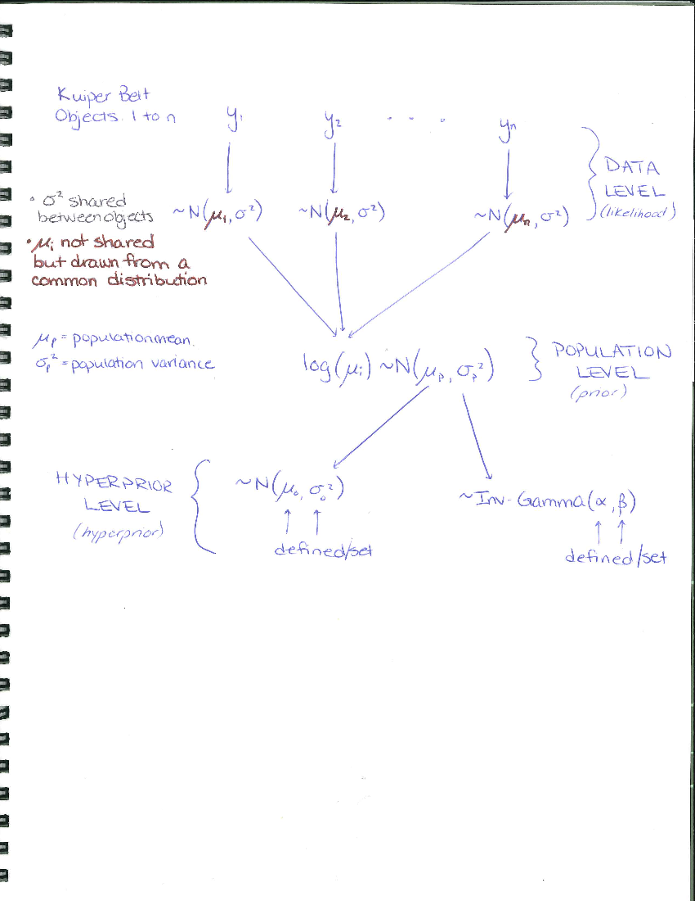

Joint vs. Conditional vs. Marginal Distributions
------------------------------------------------

The terms *joint distribution*, *conditional distribution*, and
*marginal distribution* get thrown around a lot. Let's make sure we know
what they mean before jumping into hierarchical Bayesian models.

### Joint Distribution

The *joint distribution* is the multidimensional probability
distribution of all possible parameter values. For example, if you have
two parameters *θ*1 and *θ*2 in your model, their
joint posterior distribution would be
*p*(*θ*1, *θ*2).
 You can plot this distribution in a two-dimensional plot with
*θ*1 on one axis and *θ*2 on the other. The
distribution is usually shown with contours or a scatter plot if you
have samples from the distribution.

For example, let's pretend we have a *joint distribution* that is a
multivariate normal:

    library(MASS)
    library(ggplot2)
    # draw 10,000 samples from a multivariance normal distribution
    samples = mvrnorm(n = 1e4, mu = c(1,1), Sigma = matrix(data = c(0.3, 0.1, 0.3, 0.5), nrow = 2, ncol = 2, byrow = TRUE))
    # name the columns
    colnames(samples) = c("theta1", "theta2")

    # make samples a data frame
    samples = as.data.frame(samples)

    # see what "samples" looks like using the structure function
    str(samples)

    ## 'data.frame':    10000 obs. of  2 variables:
    ##  $ theta1: num  0.731 0.306 1.377 1.203 0.899 ...
    ##  $ theta2: num  0.973 -0.107 1.153 1.784 0.937 ...

    # show the first 6 rows
    head(samples)

    ##      theta1     theta2
    ## 1 0.7313862  0.9726334
    ## 2 0.3057230 -0.1073587
    ## 3 1.3769376  1.1534526
    ## 4 1.2028439  1.7842832
    ## 5 0.8992195  0.9371344
    ## 6 2.3932415  2.7824635

    # plot the samples with some transparency
    # pch = point type to use
    plot(x=samples$theta1, y = samples$theta2, pch=19, col=rgb(0,0,1, alpha = 0.05), ylab=expression(theta[2]), xlab=expression(theta[1]), main="Samples from the joint distribution of a multivariate normal", xlim=c(-1,3), ylim=c(-2,4))
    grid()

### Conditional Distribution

The *conditional distribution* is the distribution of a parameter given
a specific value of the other parameter(s). For example, in the above
plot, we could look at the conditional distribution of *θ*2
given that *θ*1 = 1.1. We denote this as
*p*(*θ*2|*θ*1 = 1.1).
 If we were to write out the actual mathematical equation for the above
distribution, it would be a function of *θ*2 alone because we
set *θ*1 = 1.1. A way to visualize the conditional
distribution of *θ*2 given *θ*1 = 1.1 is to take a
slice through the joint distribution *at the value
*θ*1 = 1.1* and plot the distribution/histogram of
*θ*2 at that value. Let's do that next!

    # plot the samples with some transparency
    plot(x=samples$theta1, y=samples$theta2, pch=19, col=rgb(0,0,1, alpha = 0.05), ylab=expression(theta[2]), xlab=expression(theta[1]), main="Taking a slice through the joint distribution", ylim=c(-2,4), xlim=c(-1,3))
    grid()
    # add a line at 1.1. lty = line type; lwd = line width
    abline(v=1.1, lty=2, col="violet", lwd=3) 

    # because we have a finite sample from the joint distribution, very few (if any) of the values of theta_1 equal 1.1
    any(samples$theta1 ==1.1)

    ## [1] FALSE

    # so let's make a small window around theta_1 = 1.1 to approximate the conditional distribution

    # use the which() function fo get the indices of the rows that are TRUE in the logical statement 1.08 < theta1 < 1.12
    theseones = which(samples$theta1 > 1.08 & samples$theta1 < 1.12)

    # how many are in this range? 
    length(theseones)

    ## [1] 292

    # plot the samples in a histogram with the same axis as the plot above
    hist(x = samples[theseones, "theta2" ], xlim = c(-2,4), xlab=expression(p(theta[2]~"|"~theta[1]==1.1)), main = expression("Histogram of"~theta[2]~"at"~theta[1]==1.1), col="violet")
    box()

    #... or better yet plot as a density
    plot(density(samples[theseones, "theta2" ]), xlim = c(-2,4), xlab=expression(p(theta[2]~"|"~theta[1]==1.1)), main = expression("Approximate Conditional Distribution of"~theta[2]~"at"~theta[1]==1.1), col="violet", lwd=3)
    grid()

We could have chosen any value of *θ*1 and found the
conditional distribution for *θ*2 given that value. For
example, choosing *θ*1 = 0.2 gives a different conditional
distribution than *θ*1 = 1.1:

Because the conditional distribution depends on the value of
*θ*1, we can generalize and write out the conditional
distribution as a *function* of *θ*2 and *θ*1,

*p*(*θ*2|*θ*1).
 Once we have this *function*, then we can calculate the conditional
distribution of *θ*2 for any value of *θ*1.

Of course, this can all be done the other way around--- we could find
the conditional distribution of *θ*1 given *θ*2,
*p*(*θ*1|*θ*2).

When you know the conditional distributions for a model, then you can
use a Gibbs Sampler. In the case of known conditional distributions, a
Gibbs Sampler is often more efficient than a regular Metropolis
algorithm. (Recall the exercise from last class!)

### Marginal Distribution

The *marginal distribution* is the distribution of a parameter
regardless of the values of the other parameter(s). Mathematically, you
can find the marginal distribution by integrating out the unwanted,
uninteresting, or "nuisance" parameters from the joint distribution:

*p*(*θ*1)=∫*p*(*θ*1, *θ*2)*d**θ*2.
 Using our example of a multivariate normal distribution, we can look at
the marginal distribution of *θ*1 and *θ*2 by
making histograms of those parameters. Visually, this is like collapsing
all of the points in our scatterplot onto one axis and plotting a
histogram. Below we do this for both *θ*1 and
*θ*2:

    library(psych)

    ## 
    ## Attaching package: 'psych'

    ## The following objects are masked from 'package:ggplot2':
    ## 
    ##     %+%, alpha

    # this package has a nice plotting function for a scatter plot plus side histograms

    scatter.hist(x = samples$theta1, y = samples$theta2, ellipse=FALSE, correl=FALSE, density = TRUE, freq = FALSE, smooth = FALSE, pch=19, col=rgb(0,0,1,0.05), grid=TRUE, title="Marginal distributions (top and side)", xlab = expression(theta[1]), ylab=expression(theta[2]))

Notice that the marginal distributions are centered on the expected
(i.e. the mean) values for *θ*1 and *θ*2.

When you have a Markov Chain and you plot the histogram of the samples
of one of the parameters, you are looking at (an estimate of) the
marginal distribution.

### To summarize brutally

The *joint distribution* contains all the information.

The *conditional distribution* contains information about (usually) one
parameter, but it still cares about the other parameters.

The *marginal distribution* doesn't care about the other parameters.

Review of the Normal model
--------------------------

Last class, we introduced the normal model for data **y**, with mean *θ*
and variance *σ*2 (following the notation and Chapter 2 of
Gelmen et al 2014, *Bayesian Data Analysis*, CRC Press). We started by
looking at two different scenarios--- one in which the mean was known
and the variance was unknown, and then where the mean was unknown and
the variance was known. In both cases, we derived the *conditional*
distribution of the unknown parameter, given the data and the known
parameter.

For example, the conditional distribution of the mean given the data and
the variance was
*p*(*θ*|**y**, *σ*2)=*p*(**y**, *σ*2|*θ*)*p*(*θ*)
 The prior for *θ* was a normal distribution with hyperparameters
*μ*0 and *τ*02, and the conditional
distribution turned out to be a normal with mean *μ**n* and
and variance *τ**n*2.

Similarly, we also found the conditional distribution for the variance,
given the data and a known mean:
*p*(*σ*2|**y**, *θ*)=*p*(**y**, *θ*|*σ*2)*p*(*σ*2),
 which turned out to be a scaled inverse-*χ*2 distribution
with *ν*0 + *n* degrees of freedom and scale factor
$\\frac{\\nu\_0\\sigma^2\_0 + nv}{\\nu\_0+n}$, where
$v = \\frac{1}{n}\\Sigma\_i^{n}(y\_i - \\theta)^2$, and *ν*0
and *σ*02 are hyperparameters.

In Tuesday's class, we set the hyperparameters to specific values. In a
hierarchical Bayesian model, we don't do this--- instead we set
distributions for the hyperparameters, thus defining *hyperpriors*
*p*(*ν*0),*p*(*μ*0),*p*(*τ*02),and *p*(*σ*02).

Now we can use Bayes' rule recursively, so where we used to have the
joint posterior distribution of the *θ* and *σ*2 parameters
given the data **y**:
*p*(*θ*, *σ*2|**y**)∝*p*(**y**|*θ*, *σ*2)*p*(*θ*)*p*(*σ*2).
 we now have
*p*(*θ*, *σ*2|**y**)∝*p*(**y**|*θ*, *σ*2)*p*(*θ*, *σ*02|*μ*0, *τ*02, *ν*0, *σ*02)*p*(*ν*0)*p*(*μ*0)*p*(*τ*02)*p*(*σ*02).

The *hyperprior distributions* will have their own set of parameters.
For example, if we set the hyperprior distribution *p*(*ν*0)
to be a uniform, truncated prior,
$$p(\\nu\_0) = \\text{unif}(a,b) \\\\
= \\left\\{ \\begin{array}{11}{ \\frac{1}{b-a}, \\nu\_0 \\in \[ a,b \] \\\\ 0, \\text{otherwise} }\\end{array} \\right.$$
 then we would have to choose values for the upper and lower bounds
(i.e. the parameters *a* and *b*) to the best of our ability.

Example of a Hierarchical Bayesian Model for Kuiper Belt Objects
----------------------------------------------------------------

*Disclaimer: I am not a solar system scientist, so please forgive my
possibly bad choices of distributions for the following example!*

Imagine we are interested in two quantities: 1) the masses of objects in
the Kuiper Belt (KB), and 2) the distribution of masses in the KB (in
particular the population mean and variance). Now suppose we have mass
estimates for *n* KB objects, and we label this data *y**i*,
where *i* is the index of the object. With these estimates, we could
plot an empirical distribution of the masses, and estimate for the
population mean and variance. However, I think we can all agree that our
individual mass estimates are not the *true* masses of these objects,
and the uncertainty in the population mean is going to be rather large.

There is an arguably more natural way of estimating the true individual
masses and the mass distribution *at the same time*, and that is through
a hierarchical Bayesian model. In this set up, we assume that the masses
of all Kuiper Belt objects are following some underlying population
distribution, and fit for both the individual masses and the population
parameters simultaneously.

We keep our label for each KB object's mass estimate as data
*y**i*, where *i* is the index of the object. But now we
assume that each mass measurement is drawn from a normal distribution
*y**i* ∼ *N*(*μ**i*, *σ**i*2)
 with mean *μ**i* equal to the *true but unknown mass* for
object *i*, and variance *σ**i*2 which is related
to our measurement uncertainty. For this example, we will assume that
our measurement uncertainty is consistent between objects, so that they
all share the same variance, i.e.
*y**i* ∼ *N*(*μ**i*, *σ*2).

Next, we assume that the natual log of the true masses, i.e.
log*μ**i*, come from a normal distribution that defines the
*population* of KB objects. That is,
log*μ**i* ∼ *N*(*μ**p*, *σ**p*2)
 where *μ**p* is the true population mean and
*σ**p*2 is the true population variance. We then
assign prior distributions to these hyperparameters
$$ \\mu\_p \\sim N(\\mu\_0, \\sigma^2\_0) \\\\
\\text{and} \\\\
\\sigma^2\_p \\sim \\text{Inv-Gamma}(\\alpha, \\beta).$$
 and set values for *μ*0, *σ*02, *α*,
and *β* to define these distributions.

This model has a three-structure hierarchy: the data level
(*y**i*), the prior level (the population), and the
hyperprior level (distributions for the hyperparameters). For a visual
representation of the hierarchical model, see my sketch below.

Mathematically we can write this out using Bayes' Theorem. We are
interested in the true mass of each object, its variance, the population
mean, and the population variance, given the data set **y**), so the
posterior distribution is
*p*(**μ**, *σ*2, *μ**p*, *σ**p*2|**y**)∝*p*(**y**|**μ**, *σ*2, *μ**p*, *σ**p*2)*p*(**μ**, *σ*2, *μ**p*, *σ**p*2).
 Note that **μ** is bold because it is the vector of the individual true
masses of the objects. The variance *σ*2 is assumed
independent of the population mean and variance, and is shared between
objects, so
*p*(**μ**, *σ*2, *μ**p*, *σ**p*2|**y**)∝*p*(**y**|**μ**, *σ*2, *μ**p*, *σ**p*2)*p*(*σ*2)*p*(**μ**, *μ**p*, *σ**p*2).
 Next, we use Bayes' theorem again to rewrite the joint distribution
*p*(**μ**, *μ**p*, *σ**p*2) in terms of
a conditional and prior distributions,
*p*(**μ**, *σ*2, *μ**p*, *σ**p*2|**y**)∝*p*(**y**|**μ**, *σ*2, *μ**p*, *σ**p*2)*p*(*σ*2)*p*(**μ**, *σ*2|*μ**p*, *σ**p*2)*p*(*μ**p*)*p*(*σ**p*2).
 Voila! We have a hierarchical Bayesian model.

### Sampling from the Posterior Distribution of a Hierarchical Model

The posterior distribution can be sampled in various ways, and this
subject could probably take up an entire week of classes. A lot of
statistical software already exists for doing hierarchical Bayesian
analysis, so before you run off and re-invent the wheel, take a look
below! :)

-   Stan <http://mc-stan.org/users/>
    -   see the "Stan Best Practices" github page for some solid advice
        that is not necessarily limited to Stan
        <https://github.com/stan-dev/stan/wiki/Stan-Best-Practices>
    -   Stan can be used via R (RStan), Python (PyStan), Julia
        (Stan.jl), Matlab (MatlabStan), the command line (CmdStan), etc.
-   BUGS - *Bayesian inference Using Gibbs Sampling*
    <https://www.mrc-bsu.cam.ac.uk/software/bugs/>

-   JAGS - *Just Another Gibbs Sampler*
    <http://mcmc-jags.sourceforge.net/>
